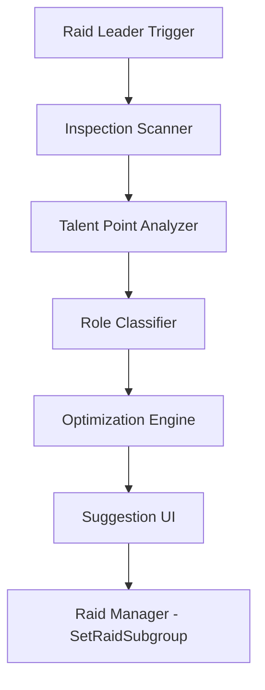

# Requirements

### Overview & Goals
Implement a "Group Composition Advisor" that helps Raid Leaders optimize raid groups in TBC. The advisor will scan player talents, determine their specific roles (e.g., Enhancement Shaman vs. Elemental Shaman), and suggest a reorganized layout that maximizes group-wide buffs.

### Scope
- **In Scope**:
    - Talent inspection of raid members (requires proximity).
    - Specialized role detection (Enhancement, Elemental, Shadow, Feral, etc.).
    - Optimization for Melee/Physical and Caster/Spell groups.
    - Interactive UI for the Raid Leader to review and apply suggestions.
    - Notification when the raid reaches 25 members.
- **Out of Scope**:
    - Automatic movement without RL confirmation.
    - Support for 10-man or 5-man optimizations (focused on 25-man).
    - Detailed individual player performance analysis.

# Technical Design

### Current Implementation
The addon currently has basic role detection based on talent points for the player and heuristics/auras for others (`WowAddonTest.lua`, `Buffs.lua`). `RaidTools.lua` provides a basic assignment UI but lacks group management features.

### Key Decisions
- **Talent Inspection Queue**: Since `NotifyInspect` is rate-limited by the server, we will implement a serial queue that processes one player at a time and waits for `INSPECT_READY`.
- **Template-Based Optimization**: Instead of a generic "best" algorithm, the advisor will use predefined templates for the most common TBC group structures (e.g., the "Melee Group" with Enhancement/Feral/Warrior/Rogues).
- **Proximity Requirement**: The UI will clearly indicate which players were successfully scanned and which were out of range/offline.

### Proposed Architecture

### New Components
- **`Scanner`**: Manages the `NotifyInspect` cycle.
- **`Optimizer`**: Logic for mapping 25 players to 5 groups based on their detected roles and template priorities.
- **`AdvisorPanel`**: A new UI component within the `RaidTools` frame.

### File Structure
- `GroupAdvisor.lua`: Core logic for scanning, analysis, and optimization.
- `RaidTools.lua`: Updated to include the Advisor UI.
- `WowAddonTest.toc`: Include `GroupAdvisor.lua`.

# Testing

### Validation Approach
Verification will require a raid environment (or simulated raid frames) to test scanning and subgroup movement.

### Key Scenarios
- **Scanning**: Verify that `/wat balance` initiates inspection and correctly identifies a Priest as "Shadow" if they have 40+ points in the Shadow tree.
- **Optimization**: Verify that an Enhancement Shaman is suggested to be moved into a group with Warriors and Rogues.
- **Interactive UI**: Verify that clicking "Apply" moves a player to the suggested subgroup in the actual raid UI.
- **Notification**: Join a raid and verify that a message appears when the 25th member joins.

# Delivery Steps

### ✓ Step 1: Implement Talent-Based Spec Detection and Scanner
Implement the talent scanning system and specialization analysis.
- Create `GroupAdvisor.lua` (and add to `.toc`).
- Implement an inspection queue to handle `NotifyInspect` throttling.
- Add an `INSPECT_READY` event handler to process talent points using `GetInspectTalentTabInfo`.
- Expand role detection logic to distinguish between sub-specs (e.g., Enhancement vs Elemental, Shadow vs Holy).

### ✓ Step 2: Implement Group Optimization Engine
Develop the logic to organize the raid into optimal groups.
- Define "Template" definitions for Melee, Caster, and Healer groups.
- Implement a scoring/sorting algorithm that assigns players to the best available slot in their preferred group type.
- Account for Shaman distribution across groups to maximize totem coverage.

### ✓ Step 3: Create Advisor UI and Integration
Add the Advisor interface to the Raid Tools frame.
- Add a new "Group Advisor" tab or section to the `WowAddonTestRaidToolsFrame`.
- Implement a "Scan & Balance" button that triggers the scanning process.
- Create a list view to display "Current" vs "Proposed" group assignments.
- Add a "Apply All" button to execute group changes.

### ✓ Step 4: Final Integration and Interactive Application
Wire up the UI to the game API and add the 25-man notification.
- Connect the "Apply" buttons to `SetRaidSubgroup`.
- Implement a listener for `GROUP_ROSTER_UPDATE` that notifies the Raid Leader when the group size hits 25.
- Add a slash command `/wat balance` to quickly open the advisor.
