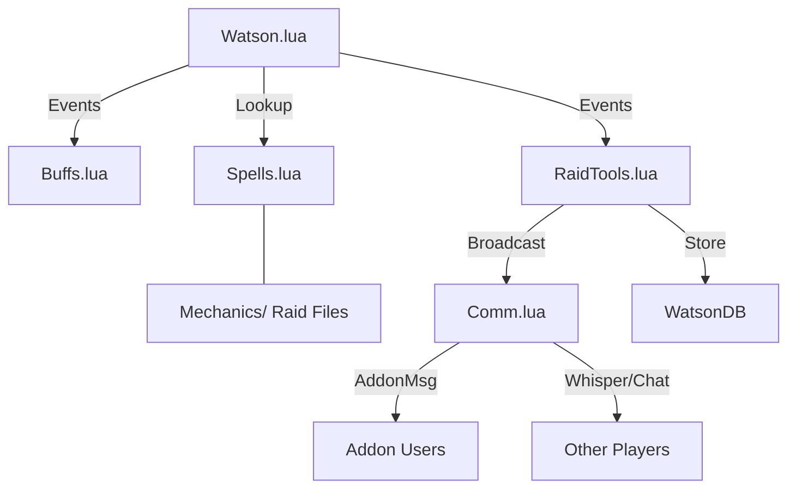

# Requirements

### Overview & Goals
The goal is to expand the existing raiding addon with essential utility features for The Burning Crusade Anniversary. This includes automated boss alerts, buff checks during ready checks, and a GUI for raid leaders to manage assignments.

### User Stories
- **Boss Mechanic Alerts**:
    - *As a Raider*, I want to receive clear alerts for dangerous boss mechanics so that I can react quickly and avoid unnecessary wipes.
    - *As a Tank/Healer*, I want role-specific instructions (e.g., "Taunt now" or "High Damage") so I know exactly how to respond to a mechanic.
- **Buff Checker**:
    - *As a Raid Leader*, I want a summary of missing buffs for the entire group during a Ready Check to ensure full preparation.
    - *As a Raider*, I want to be notified if I'm missing my own buffs during a Ready Check so I can fix it before the pull.
- **Raid Leader Tools**:
    - *As a Raid Leader*, I want a GUI to assign Tanks to icons and Mages/Warlocks to CC targets to streamline coordination.
    - *As a Raid Leader*, I want my assignments to be broadcasted automatically via addon-sync or whispers to ensure everyone sees them.
    - *As a Raider*, I want to see my specific assignments clearly so I can perform my role effectively without confusion.

### Scope
- **In Scope**:
    - Automatic alerts for boss casts and debuffs.
    - Buff checking for player and raid during Ready Checks.
    - Raid Leader GUI for Tank and CC assignments.
    - Persistence of assignments across sessions.
- **Out of Scope**:
    - Automated gameplay (e.g., auto-casting spells).
    - Advanced raid frames or damage meters.

# Technical Design

### ✓ Step 1: Enhance Boss Mechanic Alerts
- Update `Watson.lua` to handle `SPELL_AURA_APPLIED` and `SPELL_AURA_REMOVED` in `COMBAT_LOG_EVENT_UNFILTERED`.
- Refactor `Spells.lua` to support different alert types (Cast vs Aura) and act as a central registry.
- Create the `Mechanics/` folder and add `Karazhan.lua` with example TBC abilities.

### ✓ Step 2: Implement Buff Checker for Ready Checks
- Create `Buffs.lua` with a database of essential TBC buffs.
- Implement `CheckUnitBuffs(unit)` and missing buff reporting logic.
- Register and handle the `READY_CHECK` event in `Watson.lua`.

### ✓ Step 3: Create Raid Leader Assignment GUI
- Create `RaidTools.lua` and define the assignment frame using WoW XML/Lua API.
- Implement logic for Tank/Icon and CC assignments with persistence in `WatsonDB`.
- Add "Broadcast" functionality to trigger notifications.

### ✓ Step 4: Hybrid Communication and Finalization
- Create `Comm.lua` for the dual-layer communication system (Addon Message vs. Whisper).
- Integrate `Comm.lua` with `RaidTools.lua` for assignment broadcasting.
- Update `Watson.toc` with all new files and perform final cleanup.

### Current Implementation
The addon currently has a basic skeleton for boss alerts based on spell IDs and a role detection system tailored for Classic/TBC.

### Key Decisions
- **Modular Mechanics**: Organize boss abilities by raid/encounter in separate files within a `Mechanics/` folder for better maintainability.
- **Hybrid Communication**: Use a dual-layer system for assignments: hidden `SendAddonMessage` for addon users and standard Whispers/Raid Chat for everyone else.
- **Event Handling**: Use `READY_CHECK` for buff notifications and `COMBAT_LOG_EVENT_UNFILTERED` for boss mechanics (casts and auras).
- **UI Strategy**: Use pure WoW XML/Lua API for the GUI to keep the addon lightweight and dependency-free.
- **Data Storage**: Leverage `WatsonDB` to store assignments and user preferences.

### Proposed Changes
- **`Watson.lua`**:
    - Centralize event registration and distribution.
    - Expand combat log handling to track `SPELL_AURA_APPLIED` and `SPELL_AURA_REMOVED`.
- **`Comm.lua` (New)**:
    - Handles addon-to-addon synchronization and version handshaking.
    - Implements the logic to choose between hidden syncing and public whispers.
- **`Mechanics/` (New Folder)**:
    - Contains files like `Karazhan.lua`, `BlackTemple.lua`, etc., which populate the core `BossAbilities` registry.
- **`Buffs.lua` (New)**:
    - Contains tables of required buffs categorized by class and role for TBC.
    - Logic to report missing buffs based on the player's role in the raid (Leader vs. Member).
- **`RaidTools.lua` (New)**:
    - Implements the assignment GUI (Tanks, Icons, CC).
    - Interfaces with `Comm.lua` to broadcast assignments.

### Architecture Diagram

### File Structure
- `Watson.toc` (Modified: Added new files)
- `Watson.lua` (Modified: Event routing)
- `Spells.lua` (Modified: Registry initialization)
- `Comm.lua` (New: Communication layer)
- `Buffs.lua` (New: Buff data and logic)
- `RaidTools.lua` (New: UI and assignments)
- `Mechanics/*.lua` (New: Raid-specific data)